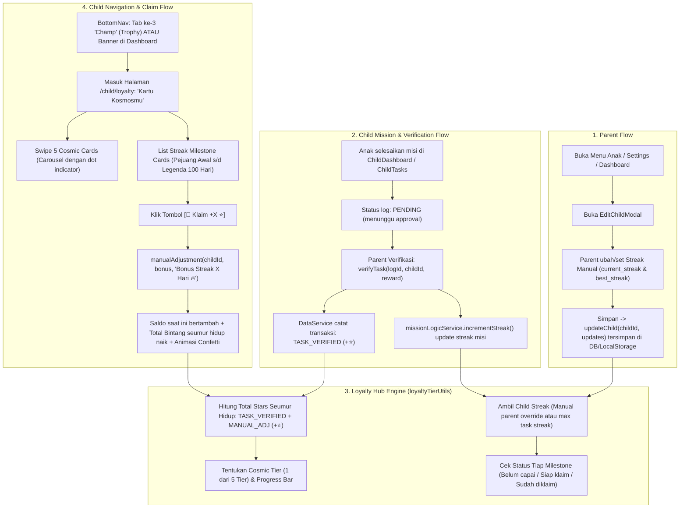
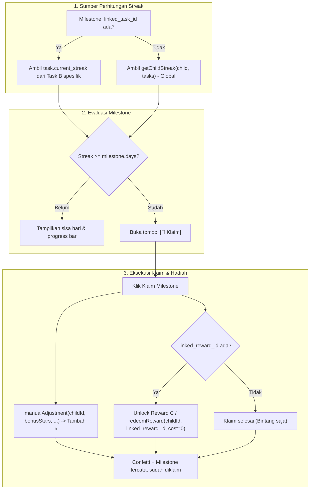

# Panduan UI/UX & Spesifikasi Teknis: Tab Champ ("Kartu Kosmosmu")

Dokumen ini membedah secara mendalam **Komponen, Warna, Desain Token, serta Alur UI/UX** agar fitur **Champ (Loyalty Hub & Streak)** 100% konsisten, harmonis, dan menyatu dengan menu-menu anak lainnya di Stars Rewards (`ChildDashboard`, `ChildTasks`, `ChildRewards`, `ChildStats`).

---

## 1. Audit Desain Token & Palet Warna Eksisting

Berdasarkan `tailwind.config.js` (tema `childTheme`):

| Token Warna | Nilai Hex | Peran & Penggunaan di Tab Champ |
|---|---|---|
| **`primary`** | `#38BDF8` (Sky Blue) | Tombol klaim, progress bar aktif, indikator tab aktif, dot carousel aktif |
| **`neutral`** | `#013576` (Deep Navy) | Warna teks utama judul (`H1Header`), judul kartu milestone, teks angka |
| **`secondary`** | `#99E6C9` (Mint Pastel) | Aksen seimbang, glow halus, gradient alternatif |
| **`warning`** | `#FFD580` (Warm Gold) | Warna bintang ⭐, koin, badge streak `🔥`, bintang bonus |
| **`success`** | `#5FE28A` (Bright Green) | Badge status `✅ Diklaim`, progress bar saat mencapai 100% |
| **`base-100`** | `#FFFFFF` (White) | Background halaman utama dan background kartu |
| **`base-200`** | `#F1F5F9` (Light Slate) | Border kartu (`border-base-200`), background progress bar yang belum terisi |
| **`base-300`** | `#CBD5E1` (Border Divider) | Garis putus-putus (*dashed line*) pembatas di dalam kartu milestone |
| **`neutral/60`** | Navy transparan 60% | Teks deskripsi misi, angka target, catatan kaki sisa hari |

---

## 2. Pilihan Komponen Eksisting yang Digunakan

Untuk menjamin konsistensi mutlak tanpa membuat library baru yang berlebihan:

1. **Header Halaman:**
   - Menggunakan navbar standar dengan back button `FaArrowLeft` (seperti di `ChildHistory.tsx` & `ClaimedRewardsHistory.tsx`), judul teks `H1Header` (`text-xl font-bold text-neutral`), dan tombol `?` di kanan.
2. **Kartu Kontainer:**
   - Menggunakan `card bg-white shadow-sm rounded-2xl p-5 border border-base-200` persis seperti kartu tugas di `ChildDashboard` dan `ChildRewards`.
3. **Progress Bar:**
   - Menggunakan DaisyUI native: `progress progress-primary w-full h-2.5 rounded-full bg-base-200` (atau `progress-success` saat 100%).
4. **Badge:**
   - Menggunakan `badge badge-warning gap-1 font-bold text-neutral` untuk bintang bonus.
   - Menggunakan `badge badge-success text-white font-bold` untuk status `✅ Diklaim`.
5. **Tombol Aksi (CTA):**
   - Tombol Klaim: `btn btn-sm btn-primary text-white font-bold rounded-full shadow-sm active:scale-95 transition-transform` (konsisten dengan tombol `btn-primary rounded-full` di dashboard).
6. **Bottom Navigation (`BottomNav.tsx`):**
   - Menambahkan item tab `Champ` dengan ikon `Trophy` dari `@phosphor-icons/react` berukuran 24px, label text-xs font-medium, konsisten dengan 4 tab lainnya.

---

## 3. Rincian UI & UX Tiap Bagian

### A. Bagian 1: Swipable Tier Carousel (Kartu Kosmos)
* **Karakter Visual:**
  - Kartu dengan rasio proporsional, sudut melengkung `rounded-3xl`, dengan gradient kosmik lembut yang selaras warna tema:
    - *Bintang Sirius (Level Kiano):* `bg-gradient-to-br from-[#013576] via-[#1E40AF] to-[#38BDF8]` (Navy ke Sky Blue).
  - Teks warna putih tegas (`text-white`), badge level aktif kuning cerah (`bg-warning text-neutral font-bold`).
  - Menampilkan Saldo Siap Tukar (368 ⭐) dan sisa bintang menuju Nebula Orion (232 ⭐ lagi).
  - Di bawah kartu: 5 titik (*dots indicator*) yang sinkron saat digeser.
* **Pengalaman Pengguna (UX):**
  - Menggunakan gesture geser sentuh (swipe horizontal) yang ringan dan alami.
  - Kartu aktif Kiano (Sirius) langsung tampil saat halaman dibuka.

### B. Bagian 2: Kartu Milestone Streak (Sesuai Referensi Visual Pengguna)
* **Karakter Visual:**
  - Kartu putih bersih dengan border halus: `card bg-white rounded-2xl p-5 shadow-sm border border-base-200`.
  - **Badge Bintang (Kiri Atas):**
    ```tsx
    <div className="badge badge-warning gap-1 font-bold text-neutral px-3 py-3 rounded-full text-xs shadow-sm">
      <FaStar className="w-3.5 h-3.5" />
      <span>+15 Bintang</span>
    </div>
    ```
  - **Judul Milestone (Bold & Jelas):**
    `text-base font-bold text-neutral mt-3 uppercase tracking-wide`
    Contoh: `PEJUANG SEMINGGU (STREAK 7 HARI)`
  - **Deskripsi Tantangan:**
    `text-xs text-neutral/70 mt-1 leading-relaxed`
    Contoh: *"Pertahankan semangat kebiasaan baikmu selama 7 hari berturut-turut seminggu penuh!"*
  - **Dashed Divider (Garis Putus-putus):**
    `border-b border-dashed border-base-300 my-4`
  - **Angka Progres & Bar:**
    - Angka kiri: `text-sm font-bold text-neutral/60` (contoh: `7`)
    - Angka kanan: `text-sm font-bold text-neutral/60` (contoh: `7`)
    - Bar: `<progress className="progress progress-primary w-full h-2.5 rounded-full bg-base-200 mt-1.5" value={current} max={target} />`
  - **Catatan Kaki & Tombol:**
    - Jika sisa: `<p className="text-xs text-neutral/60 font-medium">Ayo, sisa 5 hari lagi untuk membuka hadiah ini.</p>`
    - Jika tercapai: Tombol `<button className="btn btn-sm btn-primary text-white font-bold rounded-full gap-1">🎁 Klaim +15 ⭐</button>`
    - Jika sudah diklaim: `<span className="badge badge-ghost text-neutral/50 font-bold">✅ Hadiah sudah diklaim!</span>`

---

## 4. Tata Letak Layar Lengkap (TUI Visual)

```text
┌─────────────────────────────────────────────────────────────────────────┐
│ HEADER (Fixed top, backdrop-blur, px-4 py-3)                            │
│   ← [btn-ghost]           Kartu Kosmosmu           (?) [btn-ghost]      │
└─────────────────────────────────────────────────────────────────────────┘

┌─────────────────────────────────────────────────────────────────────────┐
│ KARTU KOSMOS SWIPABLE (Navy → Sky Blue Gradient)                        │
│                                                                         │
│   ┌─────────────────────────────────────────────────────────────────┐   │
│   │ 🌟 BINTANG SIRIUS              [🔥 Level Kamu]       [Avatar]   │   │
│   │                                                                 │   │
│   │ Kiano • Total Terkumpul: 368 ⭐                                  │   │
│   │ Saldo Siap Tukar: 368 ⭐                                         │   │
│   │                                                                 │   │
│   │ ─────────────────────────────────────────────────────────────── │   │
│   │ Target Berikutnya: 💫 Nebula Orion                              │   │
│   │ [██████████░░░░░░░░░░░░░░░░░░░░░░░░░] 23%                       │   │
│   │ Butuh 232 bintang lagi menuju Nebula Orion                      │   │
│   │                                                                 │   │
│   │ "Sirius adalah bintang paling terang — seperti kamu!"           │   │
│   └─────────────────────────────────────────────────────────────────┘   │
│                                                                         │
│                       ●  ●  🟡  ●  ● (Dot Indicator)                   │
└─────────────────────────────────────────────────────────────────────────┘

┌─────────────────────────────────────────────────────────────────────────┐
│ 🏆 PENCAPAIAN STREAK CHAMP                                              │
│ Rekor Terbaikmu: 🔥 9 Hari Berturut-turut                               │
│                                                                         │
│ ┌─────────────────────────────────────────────────────────────────────┐ │
│ │ ⭐ +5 Bintang                                                       │ │
│ │                                                                     │ │
│ │ API PEMULA (STREAK 3 HARI)                                          │ │
│ │ Jaga kebiasaan baikmu minimal 3 hari berturut-turut tanpa putus.    │ │
│ │ - - - - - - - - - - - - - - - - - - - - - - - - - - - - - - - - - - │ │
│ │ 3                                                                 3 │ │
│ │ [█████████████████████████████████████████████████████████████████] │ │
│ │ Hebat, 3 hari tercapai!                          [🎁 Klaim +5 ⭐]   │ │
│ └─────────────────────────────────────────────────────────────────────┘ │
│                                                                         │
│ ┌─────────────────────────────────────────────────────────────────────┐ │
│ │ ⭐ +15 Bintang                                                      │ │
│ │                                                                     │ │
│ │ PEJUANG SEMINGGU (STREAK 7 HARI)                                    │ │
│ │ Pertahankan semangatmu selama 7 hari berturut-turut seminggu penuh! │ │
│ │ - - - - - - - - - - - - - - - - - - - - - - - - - - - - - - - - - - │ │
│ │ 7                                                                 7 │ │
│ │ [█████████████████████████████████████████████████████████████████] │ │
│ │ Luar biasa, 7 hari komplit!                     [🎁 Klaim +15 ⭐]   │ │
│ └─────────────────────────────────────────────────────────────────────┘ │
│                                                                         │
│ ┌─────────────────────────────────────────────────────────────────────┐ │
│ │ ⭐ +30 Bintang                                                      │ │
│ │                                                                     │ │
│ │ JUARA DUA PEKAN (STREAK 14 HARI)                                    │ │
│ │ Tunjukkan konsistensimu selama dua minggu tanpa bolong!             │ │
│ │ - - - - - - - - - - - - - - - - - - - - - - - - - - - - - - - - - - │ │
│ │ 9                                                                14 │ │
│ │ [████████████████████████████████░░░░░░░░░░░░░░░░░░░░░░░░░░░░░░░░░] │ │
│ │ Ayo, sisa 5 hari lagi untuk menyelesaikan misi ini.                 │ │
│ └─────────────────────────────────────────────────────────────────────┘ │
└─────────────────────────────────────────────────────────────────────────┘

┌─────────────────────────────────────────────────────────────────────────┐
│ BOTTOM NAVIGATION (5 Tab Konsisten)                                     │
│   🏠 Home   |   📋 Missions   |   🏆 Champ   |   🎁 Rewards   |   📊 Stats │
└─────────────────────────────────────────────────────────────────────────┘
```

---

## 5. Daftar File yang Terlibat

| No | File | Perubahan |
|:--:|:---|:---|
| 1 | `src/types/index.ts` & `src/schemas/backupSchema.ts` | Menambahkan field `current_streak?: number` dan `best_streak?: number` pada `Child`. |
| 2 | `src/utils/loyaltyTierUtils.ts` | Konstanta 5 tier kosmos, konstanta 5 streak milestones, helper `getChildStreak(child, tasks)`, kalkulasi lifetime stars. |
| 3 | `src/components/layout/BottomNav.tsx` | Menambahkan tab ke-5 `Champ` (Ikon: `Trophy` 🏆, path: `/child/loyalty`). |
| 4 | `src/components/modals/EditChildModal.tsx` | Penambahan input `current_streak` dan `best_streak` manual untuk orang tua. |
| 5 | `src/components/child/LoyaltyTierCarousel.tsx` | Carousel kartu swipable 5 tier dengan dot indicator, saldo bintang, dan progress bar. |
| 6 | `src/components/child/LoyaltyStreakMilestones.tsx` | Komponen daftar kartu milestone dengan desain persis referensi visual pengguna. |
| 7 | `src/pages/child/ChildLoyalty.tsx` | Halaman utama `/child/loyalty`. |
| 8 | `src/App.tsx` | Registrasi rute `/child/loyalty`. |
| 9 | `src/pages/child/ChildDashboard.tsx` | Banner informatif *"Kartu Kosmos"* di bawah profil anak. |

---

## 6. Alur End-to-End (E2E Flow) & Koneksi ke Kode Eksisting



### Rincian Integrasi Titik-ke-Titik:
1. **Perhitungan Bintang Seumur Hidup (Lifetime Stars):**
   - Menggunakan `calcTotalEarnedStars(transactions, childId)`:
     ```ts
     transactions
       .filter(t => t.child_id === childId && (t.type === 'TASK_VERIFIED' || (t.type === 'MANUAL_ADJ' && t.amount > 0)))
       .reduce((sum, t) => sum + t.amount, 0);
     ```
   - **Penting:** Tier anak **tidak akan pernah turun** ketika anak menukarkan bintang menjadi hadiah fisik/mainan (`REWARD_REDEEMED`).
2. **Perhitungan Streak Anak (General Streak):**
   - Menggunakan `getChildStreak(child, tasks)`:
     - Jika parent menyetel streak manual di profil anak (`child.current_streak`), nilai tersebut yang digunakan.
     - Jika belum pernah disetel manual, mengambil nilai tertinggi dari `task.current_streak` seluruh misi aktif anak.
3. **Klaim Milestone Streak:**
   - Memanggil fungsi bawaan toko: `manualAdjustment(childId, milestone.bonusStars, 'Bonus Streak X Hari 🔥')`.
   - Transaksi otomatis bertambah, saldo anak bertambah, dan milestone ditandai sudah diklaim permanen dengan memeriksa riwayat deskripsi transaksi.

---

## 7. Rencana Implementasi Per Batch (Batch Execution Plan)

### 📦 Batch 1: Fondasi Model Data & Engine Loyalty
* **Tujuan:** Menyiapkan struktur data, schema validasi, dan utilitas inti perhitungan tanpa efek samping ke UI.
* **File yang Dikerjakan:**
  1. `src/types/index.ts`: Tambahkan `current_streak?: number;` dan `best_streak?: number;` pada interface `Child`.
  2. `src/schemas/backupSchema.ts`: Tambahkan field yang sama pada `childSchema` untuk kompatibilitas backup/restore.
  3. `src/utils/loyaltyTierUtils.ts`:
     - Definisi 5 Cosmic Tiers (nama, rentang bintang, gradient, deskripsi).
     - Definisi 5 Streak Milestones (3, 7, 14, 30, 100 hari beserta reward bintang).
     - Fungsi `calcTotalEarnedStars(transactions, childId)`.
     - Fungsi `getChildStreak(child, tasks)`.
     - Fungsi `calcLoyaltyProgress(totalStars)`.
     - Fungsi `isMilestoneClaimed(transactions, childId, days)`.
* **Kriteria Selesai Batch 1:** Build lulus (`npm run build`), utility pure functions bekerja sempurna.

---

### 📦 Batch 2: Kontrol Parent & Navigasi Utama
* **Tujuan:** Memberi orang tua kontrol manual streak anak, serta mengaktifkan rute & navigasi Champ.
* **File yang Dikerjakan:**
  1. `src/components/modals/EditChildModal.tsx`:
     - Tambahkan input number `Current Streak` dan `Best Streak` dengan label dan ikon api `🔥`.
     - Hubungkan dengan state lokal dan teruskan ke `onSave(child.id, { ..., current_streak, best_streak })`.
  2. `src/components/layout/BottomNav.tsx`:
     - Tambahkan tab `Champ` (posisi ke-3) dengan ikon `Trophy` dari `@phosphor-icons/react` untuk mode anak.
     - Tetap pertahankan 4 tab untuk mode parent.
  3. `src/App.tsx`:
     - Registrasi rute `/child/loyalty`.
* **Kriteria Selesai Batch 2:** Tab Champ muncul di bottom nav anak, parent bisa ubah streak anak di modal edit profil.

---

### 📦 Batch 3: Komponen UI Champ & Halaman Utama
* **Tujuan:** Membuat komponen visual swipable carousel kartu kosmos, list milestone streak, dan halaman `/child/loyalty`.
* **File yang Dikerjakan:**
  1. `src/components/child/LoyaltyTierCarousel.tsx`:
     - Carousel 5 kartu tier dengan swipe touch / tombol navigasi dan dot indicator.
     - Tampilan informasi saldo, bintang terkumpul, dan sisa bintang ke tier berikutnya.
  2. `src/components/child/LoyaltyStreakMilestones.tsx`:
     - Komponen list 5 kartu milestone streak sesuai desain referensi visual.
     - Tombol klaim bonus bintang yang memicu confetti dan fungsi klaim.
  3. `src/pages/child/ChildLoyalty.tsx`:
     - Halaman lengkap menyatukan Header ("Kartu Kosmosmu"), Carousel, dan Milestones List.
     - Modal bantuan ("Apa itu Kartu Kosmos?").
* **Kriteria Selesai Batch 3:** Halaman `/child/loyalty` dapat diakses, carousel dapat digeser, milestone ter-render rapi dan tombol klaim berfungsi.

---

### 📦 Batch 4: Integrasi Dashboard Banner, QA & Polishing
* **Tujuan:** Menghubungkan titik temu di ChildDashboard, memastikan tidak ada regresi pada verifikasi task dan penukaran reward.
* **File yang Dikerjakan:**
  1. `src/pages/child/ChildDashboard.tsx`:
     - Tambahkan banner kosmik ringkas di bawah profil anak yang mengarahkan langsung ke `/child/loyalty`.
  2. Verifikasi Build & Interaksi:
     - Jalankan `npm run build` untuk memverifikasi TypeScript dan bundler Vite.
     - Uji flow klaim: saldo bertambah, status menjadi diklaim, streak sinkron.
* **Kriteria Selesai Batch 4:** Semua komponen menyatu, E2E flow tervalidasi 100%, zero lint/build error.

---

## 8. Spesifikasi Baru: Relational Streak Linking (Streak A ➔ Misi B ➔ Hadiah C)

Fitur ini memungkinkan orang tua membuat **tantangan berantai (Chained Challenge)** di mana **Streak Milestone (A)** dapat dihubungkan secara spesifik ke **Misi/Task tertentu (B)** dan menghasilkan **Hadiah/Reward tertentu (C)**.

### A. Skenario & Use Cases Fleksibel

| Tipe Relasi | Sumber Streak | Hadiah Saat Tercapai | Contoh Nyata |
|---|---|---|---|
| **1. Global Standard** | Gabungan semua misi harian | Bonus Bintang (+⭐) | Streak 7 hari umum ➔ +15 ⭐ |
| **2. Task-Specific Streak** | Khusus Misi B tertentu | Bonus Bintang (+⭐) | 14 hari konsisten "Sikat Gigi Malam" ➔ +30 ⭐ |
| **3. Global to Reward** | Gabungan semua misi harian | Hadiah Fisik/Aktivitas C | Streak 30 hari tanpa bolong ➔ Hadiah "Main Game Seharian" |
| **4. End-to-End Chain (A ➔ B ➔ C)** | Khusus Misi B tertentu | Hadiah Fisik/Aktivitas C | 7 hari berturut-turut "Baca Buku 20 Menit" ➔ Hadiah "Beli Buku Baru" 📚 |

---

### B. Pembaruan Model Data & Skema

1. **`src/types/index.ts` (`StreakMilestone`)**:
   ```ts
   export interface StreakMilestone {
     id: string;
     days: number;
     title: string;
     description: string;
     bonusStars: number;
     // NEW: Relational Linking Fields
     linked_task_id?: string;   // ID Task/Misi spesifik (Misi B). Jika null/undefined = Global streak
     linked_reward_id?: string; // ID Reward spesifik (Hadiah C). Jika null/undefined = Hanya bintang
   }
   ```

2. **`src/schemas/backupSchema.ts` (`streakMilestoneSchema`)**:
   ```ts
   export const streakMilestoneSchema = z.object({
     id: z.string(),
     days: z.number(),
     title: z.string(),
     description: z.string(),
     bonusStars: z.number(),
     linked_task_id: z.string().optional(),
     linked_reward_id: z.string().optional(),
   });
   ```

---

### C. Alur Logika Teknis (Engine & Claim Logic)



1. **Perhitungan Progres Streak:**
   * Jika `linked_task_id` diisi: Nilai `current` diambil dari `tasks.find(t => t.id === milestone.linked_task_id)?.current_streak || 0`.
   * Jika tidak diisi: Menggunakan `getChildStreak(child, tasks)` (streak gabungan anak).
2. **Eksekusi Hadiah Ganda (Stars + Reward):**
   * Memberikan `bonusStars` ke saldo anak via `manualAdjustment`.
   * Jika `linked_reward_id` terisi:
     - Reward C dapat otomatis masuk ke riwayat penukaran anak dengan biaya 0 bintang (`cost: 0`), ATAU
     - Ditandai sebagai voucher gratis (*Unlocked Reward*) yang siap dipakai anak kapan saja tanpa memotong saldo bintang.

---

### D. Form Admin: Pengaturan Relasi di `AdminStreakForm.tsx`

Tambahkan 2 dropdown in-app single-choice (`<Listbox>`) di dalam form milestone:

1. **Dropdown "Target Misi (Mission Source)":**
   * *Opsi 1 (Default):* `⭐ Semua Misi (Global Streak)` — Akumulasi streak umum anak dari misi apapun.
   * *Opsi 2..N:* Menampilkan daftar misi aktif lengkap dengan ikon kategori (misal: `📖 Baca Buku 15 Menit`).
2. **Dropdown "Hadiah Spesial (Linked Reward)":**
   * *Opsi 1 (Default):* `⭐ Bintang Saja` — Hanya bonus bintang yang ditentukan.
   * *Opsi 2..N:* Menampilkan daftar katalog reward lengkap dengan ikon (misal: `🍦 Ice Cream Cone`, `🎮 Main Switch 30 Menit`).

---

### E. Tampilan Kartu di Halaman Anak (`LoyaltyStreakMilestones.tsx`)

Kartu milestone di `/child/loyalty` akan otomatis menampilkan penanda relasi yang menarik bagi anak:
* **Badge Misi Terkait (Kiri Atas / Bawah Judul):**
  * `<span className="badge badge-outline border-sky-300 text-sky-700 gap-1 text-[11px] font-bold"><FaTasks /> Khusus Misi: Baca Buku</span>`
* **Badge Hadiah Terkait (Kanan Atas / Di Samping Bintang):**
  * `<span className="badge bg-amber-100 text-amber-900 border-amber-300 gap-1 text-[11px] font-extrabold"><FaGift /> Hadiah: Beli Buku Baru</span>`
* **Tombol Klaim Dinamis:**
  * Menampilkan: `🎁 Klaim +15 ⭐ & Hadiah Hadir!` jika memiliki linked reward.

---

### 📦 Batch 5: Implementasi Relational Streak Linking
* **File yang Dikerjakan:**
  1. `src/types/index.ts` & `src/schemas/backupSchema.ts`: Tambah `linked_task_id` & `linked_reward_id` di `StreakMilestone`.
  2. `src/utils/loyaltyTierUtils.ts`: Update helper kalkulasi progress streak agar mengecek `linked_task_id`.
  3. `src/pages/admin/AdminStreakForm.tsx`: Tambah in-app dropdown Listbox untuk memilih Linked Task & Linked Reward.
  4. `src/components/child/LoyaltyStreakMilestones.tsx`: Render badge info misi dan hadiah terkait di kartu milestone serta update handler klaim.
  5. `src/store/useAppStore.ts`: Update fungsi klaim milestone agar meng-handle auto-grant atau unlock linked reward.

